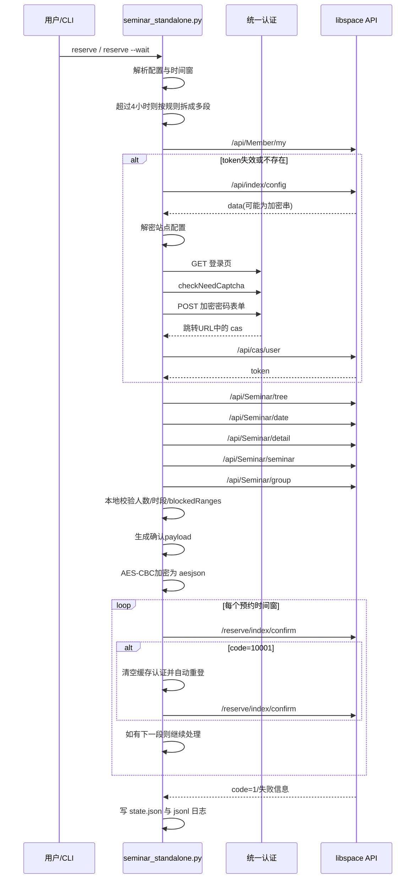

# 预约加密与完整流程说明

这份文档基于当前仓库实现，专门解释两件事：

1. 预约请求到底用了什么加密。
2. 从登录到最终提交，整套预约逻辑是怎么跑通的。

相关代码入口：

- [python/libspace_cli/crypto.py](../python/libspace_cli/crypto.py)
- [python/libspace_cli/http.py](../python/libspace_cli/http.py)
- [python/libspace_cli/api.py](../python/libspace_cli/api.py)
- [python/libspace_cli/authserver.py](../python/libspace_cli/authserver.py)
- [python/libspace_cli/seminar_service.py](../python/libspace_cli/seminar_service.py)
- [python/libspace_cli/seminar_standalone.py](../python/libspace_cli/seminar_standalone.py)
- [python/libspace_cli/commands.py](../python/libspace_cli/commands.py)
- [python/libspace_cli/reserve_service.py](../python/libspace_cli/reserve_service.py)

## 先说结论

当前项目里实际有两套加密逻辑：

- 统一认证登录页密码加密
- 图书馆预约确认接口 `aesjson` 加密

其中和“真正预约提交”直接相关的是第二套：

- 普通座位确认接口：`/api/Seat/confirm`
- 研讨室确认接口：`/reserve/index/confirm`

这两个接口都会把原始 JSON 先做 AES-CBC 加密，再 Base64，最后放进：

```json
{
  "aesjson": "..."
}
```

按当前实现，真正生效的研讨室提交通道是 `/reserve/index/confirm`，不是 `/api/Seminar/submit`。`submit_seminar()` 这个 API 包装还保留在代码里，但当前预约流程没有调用它。

## 一、预约确认接口的加密方式

实现位置：

- [python/libspace_cli/crypto.py](../python/libspace_cli/crypto.py)
- [python/libspace_cli/http.py](../python/libspace_cli/http.py)

### 1. 算法

当前实现使用：

- `AES-CBC`
- `PKCS7 padding`
- `Base64` 作为最终传输编码

### 2. IV

IV 是固定值：

```python
IV = b"ZZWBKJ_ZHIHUAWEI"
```

长度正好是 16 字节，符合 AES-CBC 的块长度要求。

### 3. 密钥生成规则

密钥不是写死的，而是“按日期生成”的每日密钥。

代码：

```python
def build_daily_aes_key(date: datetime | None = None, time_zone: str = "Asia/Shanghai") -> str:
    base = get_zoned_date_key(date, time_zone)
    return f"{base}{base[::-1]}"
```

也就是说：

- 先取时区内当天日期，格式是 `YYYYMMDD`
- 再把这个字符串倒序
- 最后拼起来得到 16 位 key

例如 `2026-04-15` 这一天：

```text
base     = 20260415
reverse  = 51406202
key      = 2026041551406202
```

这个 key 会被直接转成 UTF-8 字节，作为 AES key 使用。

### 4. 明文是怎么变成密文的

原始 payload 会先被压成紧凑 JSON：

```python
plain = json.dumps(payload, ensure_ascii=False, separators=(",", ":")).encode("utf-8")
```

然后做 PKCS7 补位，再 AES-CBC 加密，再 Base64：

```python
cipher = AES.new(key, AES.MODE_CBC, iv=IV)
encrypted = cipher.encrypt(_pad(plain))
return base64.b64encode(encrypted).decode("ascii")
```

### 5. 加密后请求体长什么样

真正发请求时，HTTP 层不会直接发原始 JSON，而是包装成：

```json
{
  "aesjson": "<base64密文>",
  "authorization": "bearer<token>"
}
```

同时 header 里也会带：

```text
authorization: bearer<token>
Content-Type: application/json
X-Requested-With: XMLHttpRequest
lang: zh
```

注意：

- 按当前实现，`authorization` 的值是 `bearer{token}`，中间没有空格
- body 里是否追加 `authorization`，由 `include_authorization_in_body` 控制
- 预约确认接口当前会同时在 header 和 body 中都带上它

对应代码在 [python/libspace_cli/http.py](../python/libspace_cli/http.py)：

```python
if encrypt:
    body = {"aesjson": encrypt_payload(payload, date=date, time_zone=self.time_zone)}
else:
    body = payload

if self.token and include_authorization_in_body:
    body["authorization"] = headers["authorization"]
```

## 二、站点配置返回值也可能是加密的

实现位置：

- [python/libspace_cli/api.py](../python/libspace_cli/api.py)

`/api/index/config` 这个接口的 `data` 字段有时会直接返回一段加密字符串。
当前实现会用和预约确认相同的“每日 AES key + 固定 IV”规则解密它：

```python
plain_text = decrypt_payload(decrypted, time_zone=self.http.time_zone)
```

解密后会把结果放进 `data_decrypted`，后续登录流程靠这个配置判断：

- 当前站点是不是 CAS 登录
- CAS 登录入口地址是什么

## 三、统一认证登录页的密码加密

实现位置：

- [python/libspace_cli/authserver.py](../python/libspace_cli/authserver.py)

这套加密和预约确认接口不是一回事，它只用于统一认证页面登录。

### 1. 需要先拿登录页参数

程序会先请求 CAS 登录页，然后从 HTML 里提取：

- `execution`
- `pwdEncryptSalt`
- `contextPath`

其中 `pwdEncryptSalt` 是登录密码加密的 AES key。

### 2. 登录页密码加密规则

当前实现是：

- AES-CBC
- key = 页面返回的 `pwdEncryptSalt`
- IV = 随机 16 字符串
- 明文 = `64位随机串 + 原始密码`
- 最终输出 = Base64

代码核心：

```python
iv = random_provider(16).encode("utf-8")
plain_text = (random_provider(64) + password).encode("utf-8")
cipher = AES.new(salt.encode("utf-8"), AES.MODE_CBC, iv=iv)
return base64.b64encode(cipher.encrypt(_pad(plain_text))).decode("ascii")
```

### 3. 登录页完整流程

程序会：

1. 请求 CAS 登录页
2. 提取 `execution` 和 `pwdEncryptSalt`
3. 调用 `checkNeedCaptcha.htl` 判断是否需要验证码/滑块
4. 如果需要验证码，自动登录直接终止
5. 否则提交加密后的密码表单
6. 从跳转 URL 里解析 `cas`
7. 再把 `cas` 交给 libspace 的 `/api/cas/user` 换 token

## 四、研讨室预约的完整逻辑

核心入口：

- CLI 入口：[python/seminar_cli.py](../python/seminar_cli.py)
- 主要逻辑：[python/libspace_cli/seminar_standalone.py](../python/libspace_cli/seminar_standalone.py)
- 校验和 payload 生成：[python/libspace_cli/seminar_service.py](../python/libspace_cli/seminar_service.py)

### 1. 启动与上下文初始化

程序先创建 `SeminarToolContext`，里面包含：

- 运行目录
- 配置文件
- 状态文件
- 日志器
- `LibraryApi`

也就是这一步把：

- `seminar.config.local.json`
- `python/runtime/state.json`
- `python/runtime/logs/*.jsonl`

都串起来了。

### 2. 解析预约参数

程序会先解析：

- 日期
- 开始时间
- 结束时间
- 参与成员学号
- 标题、内容、手机号、是否公开
- 触发时间
- 房间选择策略

研讨室工具默认只接受“当天”预约。

### 3. 超过 4 小时时自动拆单

规则在 [python/libspace_cli/seminar_standalone.py](../python/libspace_cli/seminar_standalone.py)：

- 单次最长 `4 小时`
- 超过 `4 小时` 就按规则拆成多段
- 相邻两段之间固定空档 `15 分钟`
- 每段时长都不超过 `4 小时`
- 最后一段至少保留 `60 分钟`

例如：

```text
08:00 -> 20:00
```

会拆成：

```text
08:00-12:00
12:15-16:15
16:30-20:00
```

而且按当前实现：

- `15 分钟` 只体现在预约时间窗之间的空档
- API 提交会按拆分后的时间窗顺序连续发送
- 不会在两段之间真实等待 `15 分钟`

### 4. 调度控制

如果是 `--wait` 模式，程序会先检查触发时间窗口：

- 太早则等待到触发时间
- 如果已经晚于触发时间并启用了 rollover，会顺延到次日同一触发时间

这里用的是本地时间调度，不涉及加密，只决定“什么时候开始真正请求”。

### 5. 自动认证

预约前一定先走 `_ensure_authenticated()`：

1. 如果本地 state 里有 token，先请求 `/api/Member/my` 验证
2. token 可用就直接继续
3. token 失效就清空缓存并重新自动登录
4. 自动登录成功后再次请求 `/api/Member/my` 验证

### 6. 房间候选集生成

程序会先请求：

- `/api/Seminar/tree`

然后把树拍平成房间列表，只保留 `isValid == 1` 的房间。

选房规则：

- 如果显式传了 `--room-id`，就只尝试那个房间
- 否则按 `priorityRoomIds` 的顺序逐个尝试

### 7. 当天可约判断

程序会先请求：

- `/api/Seminar/date`

这里有个很重要的兼容逻辑：

- 如果接口明确返回可约日期列表，而且目标日期不在里面，就直接跳过该房间
- 如果接口返回空列表，不会提前判死刑

也就是说，空日期列表现在只被视为“信息不充分”，不是“当天不可约”。

### 8. 获取房间详情与当天实时规则

接着程序请求：

- `/api/Seminar/detail`
- `/api/Seminar/seminar`

然后从中提取：

- 开放时间
- 最小/最大人数
- 最短/最长时长
- 禁用时间段
- 是否需要上传材料

### 9. 解析参与成员

程序不会拿副账号登录，而是调用：

- `/api/Seminar/group`

把每个学号解析成成员信息，再拼成：

- `member_ids`
- `teamusers`

这里有两个细节：

- 会去重
- 不允许把主账号本人再写进参与成员列表

按当前实现，请求 `/api/Seminar/group` 时会把当前房间 id 放到字段 `area` 里，这个行为是按前端现状对齐的。

### 10. 本地校验

真正提交前，程序会先本地校验每个预约窗口：

- 结束时间不能晚于 `22:30`
- 不能早于房间开放时间
- 不能晚于房间关闭时间
- 预约时长要满足房间最短/最长限制
- 不能和 blocked range 冲突
- 人数要满足最小/最大人数限制
- 需要上传材料的房间直接跳过

注意人数校验会在两个阶段发生：

- 先按原始输入学号数量做一轮
- 成员解析完成后，再按真正解析成功且去重后的成员数再做一轮

### 11. 构造提交 payload

研讨室确认请求的原始明文 payload 由 `build_seminar_confirm_payload()` 生成，大致长这样：

```json
{
  "day": "2026-04-15",
  "start_time": "08:00",
  "end_time": "12:00",
  "title": "课程讨论",
  "content": "结构设计课程研讨",
  "mobile": "13800000000",
  "room": 69,
  "open": "1",
  "file_name": "",
  "file_url": "",
  "id": 2,
  "teamusers": "11,12"
}
```

这里有几点值得注意：

- `room` 传的是 `roomId`
- `teamusers` 是参与成员 id 的逗号串
- `id` 当前实现固定传 `2`
- 上传材料相关字段当前固定为空串

### 12. 加密提交

构造好明文 payload 后，程序调用：

- `LibraryApi.confirm_seminar_reservation()`

它最终会走到：

- `POST /reserve/index/confirm`
- `encrypt=True`

也就是把上面的明文 JSON 包成：

```json
{
  "aesjson": "<密文>",
  "authorization": "bearer<token>"
}
```

然后发给服务端。

### 13. 多段预约提交顺序

如果只是一段预约：

1. 加密
2. 提交
3. 成功结束

如果是多段预约：

1. 按拆分后的时间窗顺序逐段提交
2. 每成功一段就记录这一段的结果
3. 如果某一段返回 `code=10001`，会清空缓存认证并自动重登
4. 重登成功后只重试当前失败段一次
5. 如果重试后仍失败，状态会记成“部分成功”

### 14. 结果落盘与日志

程序会把结果写到：

- `python/runtime/state.json`
- `python/runtime/logs/YYYY-MM-DD.jsonl`

里面会记录：

- 成功
- schedule miss
- api error
- partial success
- no available target

这样后面查失败原因时，不只看终端输出，也能直接查 state 和 jsonl。

## 五、普通座位预约和研讨室预约的关系

普通座位预约和研讨室预约不是同一条业务逻辑，但“最终确认提交的加密方式”是一致的。

普通座位流程在：

- [python/libspace_cli/reserve_service.py](../python/libspace_cli/reserve_service.py)

它最终调用：

- `LibraryApi.confirm_seat()`
- `POST /api/Seat/confirm`
- `encrypt=True`

所以普通座位确认接口也会走同样的：

- 每日 AES key
- 固定 IV
- PKCS7
- Base64
- `aesjson` 包装

## 六、研讨室预约完整时序图



## 七、最容易看错的几个点

- 研讨室真正提交接口是 `/reserve/index/confirm`，不是当前未使用的 `/api/Seminar/submit`
- 预约确认加密和统一认证密码加密是两套不同规则
- `/api/index/config` 的 `data` 也可能需要先解密
- `availableDays` 为空不会再被直接判定为“当天不可约”
- 超过 4 小时时，程序会把预约时间窗拆成多段，但 API 提交仍会顺序连续发送，不会真实等待 15 分钟

## 八、如果你要自己复现抓包里的加密

只看预约确认接口的话，最小复现步骤是：

1. 准备原始 JSON payload
2. 取当天 `YYYYMMDD`
3. 拼出 key=`YYYYMMDD + reversed(YYYYMMDD)`
4. 用固定 IV `ZZWBKJ_ZHIHUAWEI`
5. 做 `AES-CBC + PKCS7`
6. 对密文做 Base64
7. 请求体里传 `aesjson`

伪代码如下：

```python
plain = compact_json(payload).encode("utf-8")
key = (date_yyyymmdd + date_yyyymmdd[::-1]).encode("utf-8")
iv = b"ZZWBKJ_ZHIHUAWEI"
aesjson = base64.b64encode(AES_CBC_PKCS7_Encrypt(plain, key, iv)).decode()
body = {
    "aesjson": aesjson,
    "authorization": f"bearer{token}",
}
```

如果你要复现的是统一认证页密码加密，则不能用这套规则，必须改成：

- key = `pwdEncryptSalt`
- iv = 随机 16 字符
- 明文 = `64位随机串 + password`
